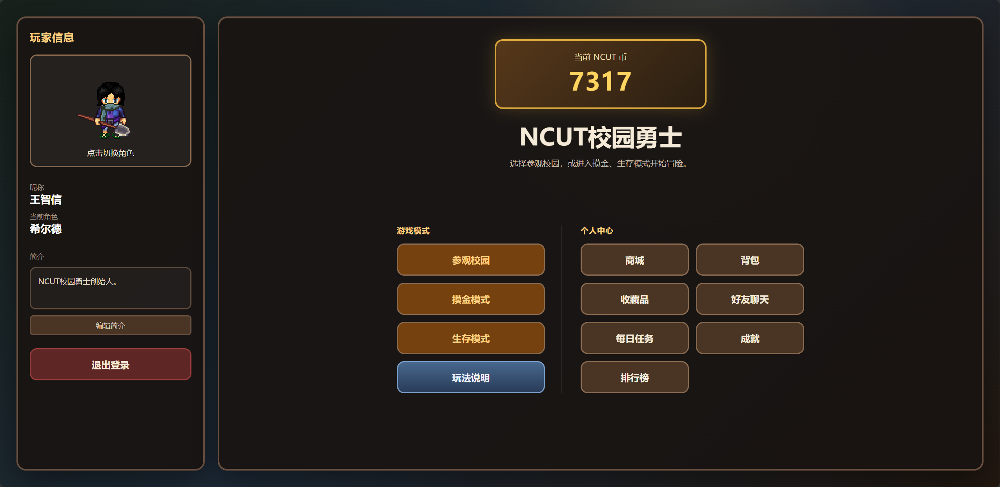
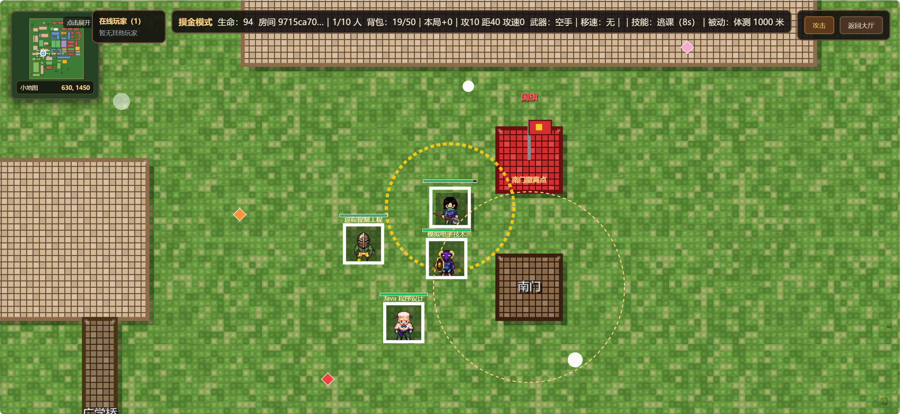
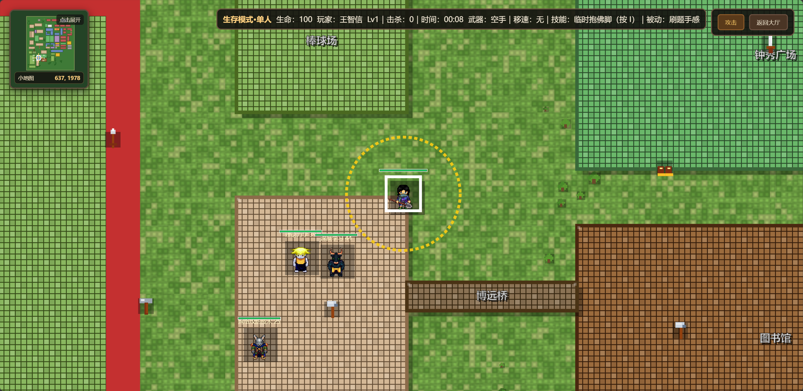
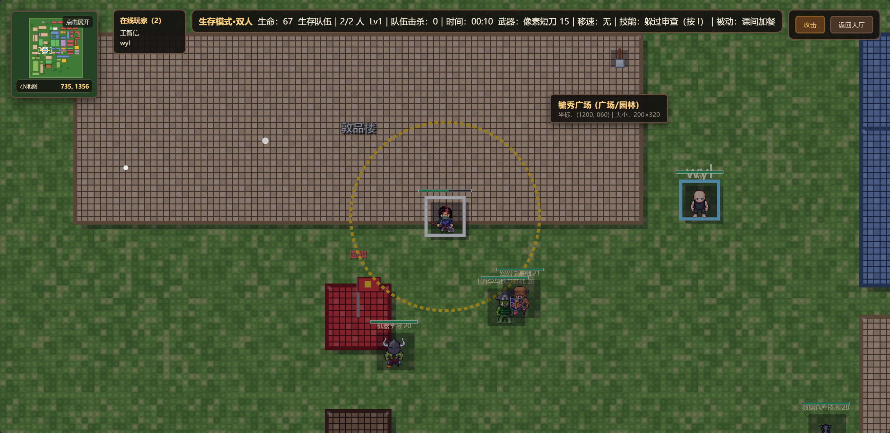
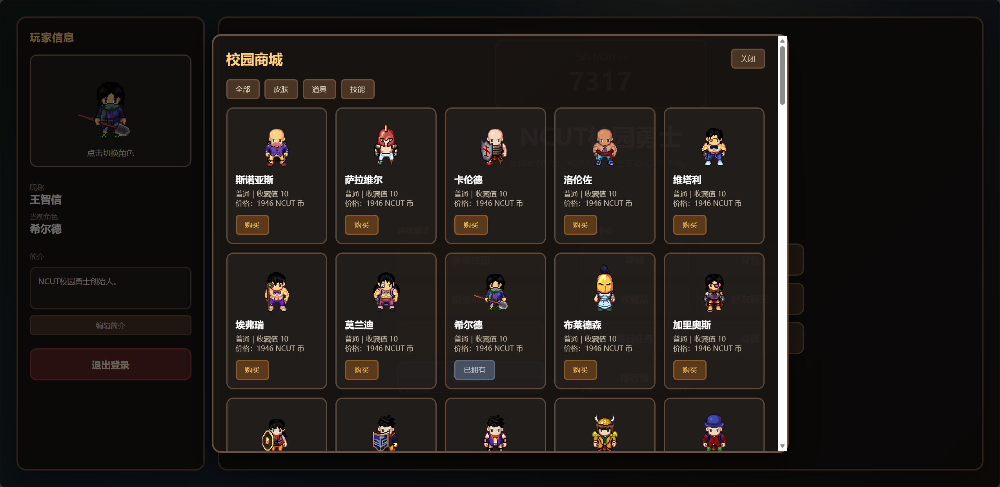
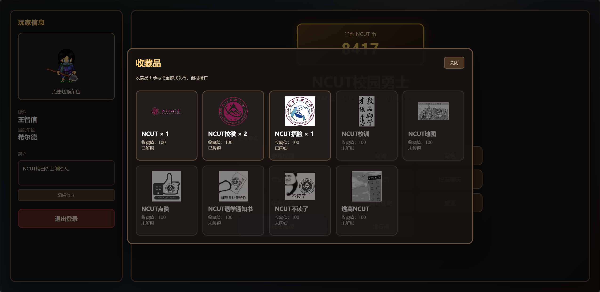
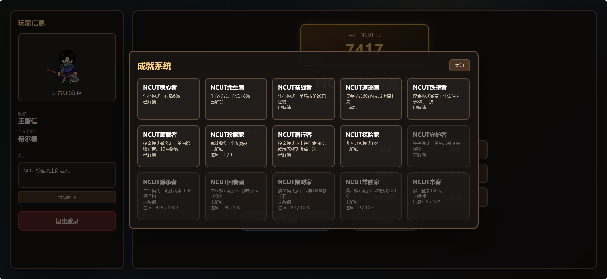
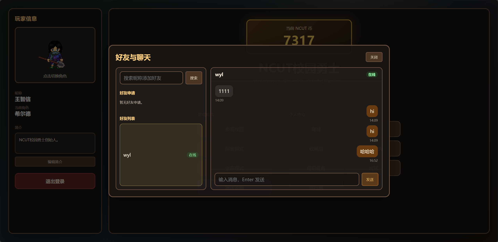
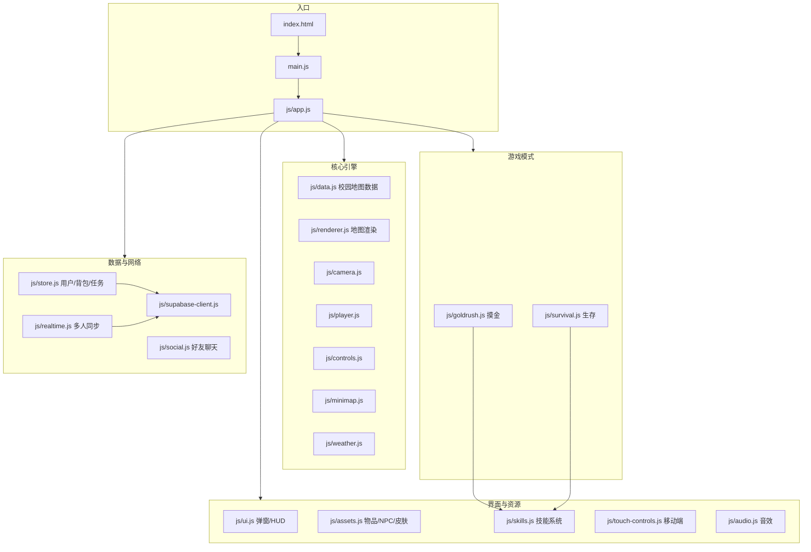

# NCUT 校园勇士

基于 **北方工业大学（NCUT）** 真实校园地图的像素风 HTML5 网页游戏。玩家可注册登录后在大厅选择 **参观校园**、**摸金模式** 或 **生存模式**，体验探索、搜刮、战斗与多人同步；同时支持商城、背包、收藏品、成就、好友聊天与排行榜等完整养成系统。

---

## 项目灵感
本人临近大四毕业，总想着做些什么来纪念一下自己的大学，自己刚好也是计算机专业的学生，开始只想着做一个北方工业大学的平面地图出来，但后来突发奇想，为什么不能开发一款NCUT校园主题的游戏？于是制作了这款NCUT校园勇士游戏。原本想着做成3D版本的，但奈何本人能力不足，就简化为平面的了。

## 项目展示

### 游戏大厅

登录后进入主界面，可切换角色、查看 NCUT 币，并选择游戏模式或个人中心功能。



---

### 游戏模式

| 模式 | 说明 |
|------|------|
| **参观校园** | 自由浏览像素校园地图，查看建筑信息，支持多人在线同图 |
| **摸金模式** | 搜刮宝石与物资、击败 NPC/玩家、寻找撤离点并带出收益 |
| **生存模式** | 抵御持续进化的怪物浪潮，支持单人 / 双人 / 四人组队 |

#### 摸金模式



#### 单人生存模式



#### 双人生存模式



---

### 个人中心与社交

#### 校园商城

购买角色皮肤、武器、工具、技能与背包扩容等道具。



#### 收藏品

在摸金模式中稀有掉落的 NCUT 主题藏品，累计收藏值。



#### 成就系统

覆盖摸金、生存、参观、登录等多维度成就目标。



#### 好友与聊天

添加好友、收发消息，查看在线状态。



---

## 核心功能

- **账号系统**：注册 / 登录，昵称与简介编辑
- **经济系统**：NCUT 币、商城购买、背包物品出售、摸金带出收益
- **物品系统**：皮肤、武器、工具、移速道具、宝石、收藏品、医疗包、技能
- **战斗系统**：普攻、技能、武器耐久、NPC 追击、PVP（摸金房间，生存模式双人、四人匹配）
- **多人同步**：参观模式全局 Broadcast；摸金 / 生存房间匹配与位置同步
- **任务与排行**：每日任务（北京时间 0 点重置）、多榜排行榜
- **移动端适配**：虚拟摇杆、横屏提示、触控战斗按钮
- **音效**：Web Audio 合成攻击音效（玩家 / NPC 区分）

---

## 技术栈

| 类别 | 技术 |
|------|------|
| 前端 | HTML5、CSS3、原生 JavaScript（无框架） |
| 渲染 | Canvas 2D（地图、角色、特效、小地图） |
| 后端 | [Supabase](https://supabase.com/)（PostgreSQL + REST + Realtime + Storage） |
| 资源 | Supabase Storage（`game-assets` 桶：皮肤、NPC、藏品等） |

---

## 项目架构

所有模块挂载在全局命名空间 `window.NCUTMap` 下，由 `main.js` 调用 `app.initCampusMap()` 启动。



### 状态流转

```
登录/注册 → 游戏大厅 → 参观 | 摸金 | 生存 → 结算/返回大厅
```

`app.js` 中的 `appState.mode` 控制当前视图：`auth` / `lobby` / `visit` / `goldrush` / `survival`，统一 `requestAnimationFrame` 游戏循环驱动玩家、相机、模式逻辑与渲染。

---

## 目录结构

```
ncut2/
├── index.html              # 页面入口（登录、大厅、Canvas、HUD、移动端控件）
├── main.js                 # 启动脚本
├── style.css               # 全局样式
├── manifest.webmanifest    # PWA 配置（横屏）
├── images/                 # 项目展示截图（README 用）
├── js/
│   ├── app.js              # 应用主状态机、模式切换、游戏循环
│   ├── constants.js        # 地图缩放、移速等全局常量
│   ├── data.js             # 建筑、道路、树木等校园地图数据
│   ├── renderer.js         # Canvas 地图与角色渲染
│   ├── player.js           # 玩家移动（键盘 + 摇杆）
│   ├── camera.js           # 相机跟随与缩放
│   ├── controls.js         # 鼠标/触摸地图拖拽
│   ├── goldrush.js         # 摸金模式逻辑
│   ├── survival.js         # 生存模式逻辑
│   ├── skills.js           # 主动/被动技能
│   ├── assets.js           # 物品、皮肤、NPC、藏品定义
│   ├── store.js            # 用户、背包、商城、任务、成就、排行
│   ├── ui.js               # 大厅弹窗与结算界面
│   ├── auth.js             # 认证封装
│   ├── realtime.js         # 多人 presence / 房间 / Broadcast
│   ├── social.js           # 好友与聊天
│   ├── supabase-client.js  # Supabase 客户端配置
│   ├── touch-controls.js   # 移动端摇杆与按钮
│   ├── audio.js            # 战斗音效
│   ├── minimap.js          # 小地图
│   ├── weather.js          # 天气粒子效果
│   └── ...
├── supabase-schema.sql     # 完整数据库 Schema
├── multiplayer-schema.sql  # 多人同步补充表
├── REALTIME_SETUP.md       # Realtime 配置说明
└── scripts/
    └── loadtest-supabase.mjs  # Supabase 压测脚本
```

---

## 游戏模式说明

### 参观模式

- 自由移动浏览 NCUT 像素校园，悬停建筑显示名称与坐标
- 支持多人在线，位置通过 Realtime Broadcast + DB 心跳同步
- 无战斗，适合导览与社交

### 摸金模式

- 开局选择携带装备与主动/被动技能，空手或带装进入地图
- 地图随机刷新宝石、武器掉落、稀有收藏品与 NPC
- 击败 NPC 或与其他玩家 PVP，搜刮物资后前往 **撤离点** 等待 20 秒成功撤离
- 死亡或未撤离则本局背包物品丢失；成功撤离物品带回账户
- 支持自动匹配房间（最多约 10 人），共享 NPC 由房主同步

### 生存模式

- 空手出生，无法携带局外道具
- 地图刷新武器、移速道具、医疗包；怪物随时间进化增强
- **单人 / 双人 / 四人** 组队，共享怪物与击杀
- 阵亡后可观战，全队阵亡统一结算；排行榜按生存时长优先

---

## 操作说明

### PC

| 按键 | 功能 |
|------|------|
| `W A S D` / 方向键 | 移动 |
| 鼠标拖拽 | 移动视角 |
| 滚轮 | 缩放地图 |
| `K` | 攻击 |
| `L` | 拾取 |
| `I` | 释放主动技能 |
| `J` | 撤离（仅摸金） |

### 移动端

- 左下 **虚拟摇杆** 移动
- 右下 **攻击 / 拾取 / 技能**（摸金另有撤离按钮）
- 建议 **横屏** 游玩

---

## 快速开始

### 1. 克隆项目

```bash
git clone https://github.com/WZXCoder/NCUT-Campus-Warriors.git
cd NCUT-Campus-Warriors
```

### 2. 本地运行

任意静态 HTTP 服务即可，例如：

```bash
# Python 3
python -m http.server 8080
```

浏览器访问 `http://localhost:8080/index.html`。

> 直接双击打开 `index.html` 可能因 CORS 导致部分功能异常，建议使用本地服务器。

### 3. 配置 Supabase（可选，启用云端存档与多人）

1. 在 [Supabase](https://supabase.com/) 创建项目
2. 在 SQL Editor 依次执行：
   - `supabase-schema.sql`（完整 Schema）
   - 若需多人，参考 `multiplayer-schema.sql` 与 `REALTIME_SETUP.md`
3. 编辑 `js/supabase-client.js`，填入你的 **Project URL** 与 **anon public key**
4. 在 Storage 创建 `game-assets` 公共桶并上传皮肤、NPC、藏品等资源（路径需与 `js/assets.js` 中 `ASSET_BASE_URL` 一致）

未配置 Supabase 时，游戏会回退到 **localStorage 本地存档**，单人可玩，多人功能不可用。


## 移速调参（开发者）

全局移速常量位于 `js/constants.js` 的 `MOVEMENT` 对象：

```javascript
const MOVEMENT = {
    PLAYER_BASE_SPEED: 0.02,   // 玩家基础移速
    MOVE_TICK_SCALE: 48,       // 移速倍率（PC/移动端共用）
    NPC_SPEED_RATIO_MIN: 0.9,  // NPC 相对玩家速度下限
    NPC_SPEED_RATIO_MAX: 1.2,  // NPC 相对玩家速度上限
};
```

- 玩家实际位移计算：`js/player.js` → `update()`
- 摸金 NPC 生成：`js/goldrush.js` → `randomEntityMoveStep()`
- 生存 NPC 生成：`js/survival.js` → `randomEntityMoveStep(scale)`（随时间缩放）

---

## 相关文档

- [REALTIME_SETUP.md](./REALTIME_SETUP.md) — 参观 / 摸金 / 生存多人模式 Supabase 配置指南
- [supabase-schema.sql](./supabase-schema.sql) — 数据库表结构
- [multiplayer-schema.sql](./multiplayer-schema.sql) — 多人 presence 与房间表

---
